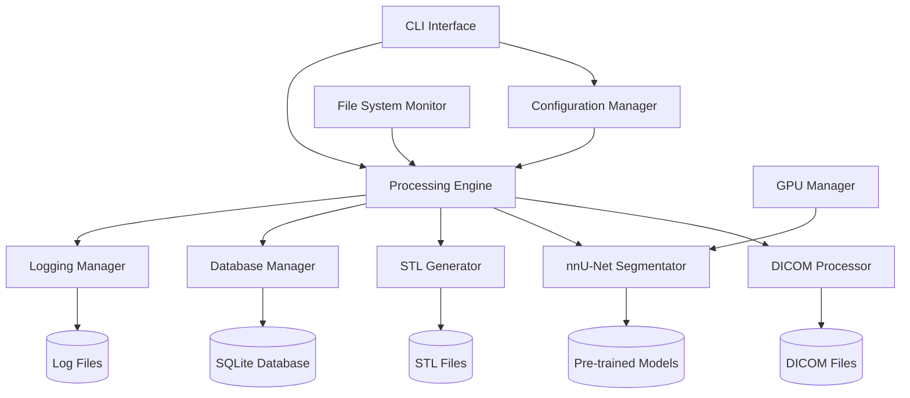

# Design Document

## Overview

本設計書は、歯科用DICOM画像から3DモデルSTLファイルを生成するPythonアプリケーションの技術設計を定義します。本システムは`git clone`後、`uv`を使用して簡単にセットアップできるよう設計されています。

主要技術スタック:

- **Python 3.9+**: メインプログラミング言語
- **PyTorch**: nnU-Net実行環境
- **nnU-Net**: セグメンテーションフレームワーク
- **pydicom**: DICOM画像処理
- **trimesh/pymeshlab**: STL生成・メッシュ処理
- **SQLite**: 処理履歴・メタデータ管理
- **Click**: CLI インターフェース

## Architecture

### High-Level Architecture



### System Components

- **CLI Interface**: ユーザーからのコマンドライン入力を処理
- **Configuration Manager**: 設定ファイルとパラメータ管理
- **Processing Engine**: メイン処理ループとワークフロー制御
- **DICOM Processor**: DICOM画像の読み込み・検証・前処理
- **nnU-Net Segmentator**: 歯科セグメンテーション実行
- **STL Generator**: セグメンテーション結果からSTLファイル生成
- **Database Manager**: 処理履歴とメタデータ管理
- **Logging Manager**: ログ管理とエラートラッキング
- **File System Monitor**: ファイルシステムの監視と容量チェック
- **GPU Manager**: GPU使用状況の監視と最適化

## Components and Interfaces

### Core Interfaces

```typescript
// Configuration Interfaces
interface AppConfig {
  input_directory: string;
  output_directory: string;
  model_path: string;
  gpu_enabled: boolean;
  log_level: 'DEBUG' | 'INFO' | 'WARNING' | 'ERROR';
  parallel_jobs: number;
  segmentation_params: SegmentationParams;
}

interface SegmentationParams {
  model_name: string;
  confidence_threshold: number;
  post_processing: boolean;
  mesh_simplification: boolean;
  smoothing_iterations: number;
}

// Data Interfaces
interface DICOMSeries {
  series_uid: string;
  study_uid: string;
  patient_id: string;
  modality: string;
  file_paths: string[];
  image_dimensions: [number, number, number];
  spacing: [number, number, number];
  created_at: Date;
}

interface SegmentationResult {
  id: string;
  dicom_series_uid: string;
  model_version: string;
  confidence_scores: number[];
  detected_teeth_count: number;
  processing_time_seconds: number;
  memory_usage_mb: number;
  status: 'SUCCESS' | 'FAILED' | 'PARTIAL';
  error_message?: string;
  created_at: Date;
}

interface STLOutput {
  id: string;
  segmentation_result_id: string;
  file_path: string;
  file_size_bytes: number;
  mesh_vertices: number;
  mesh_faces: number;
  anatomical_region: string;
  is_watertight: boolean;
  created_at: Date;
}

// Processing Status
interface ProcessingJob {
  job_id: string;
  dicom_series_uid: string;
  status: 'QUEUED' | 'PROCESSING' | 'COMPLETED' | 'FAILED';
  progress_percentage: number;
  started_at?: Date;
  completed_at?: Date;
  error_details?: string;
}
```

### CLI Interface

**Responsibilities:**

- コマンドライン引数の解析
- バッチ処理の開始と進捗表示
- エラーメッセージの表示

**Key Methods:**

- `main()`: メインエントリーポイント
- `validate_arguments()`: 引数検証
- `display_progress()`: 進捗表示

### Configuration Manager

**Responsibilities:**

- 設定ファイルの読み込み・検証
- 環境変数との統合
- デフォルト値の管理

**Key Methods:**

- `load_config(config_path: str) -> AppConfig`
- `validate_config(config: AppConfig) -> bool`
- `get_model_paths() -> List[str]`

### Processing Engine

**Responsibilities:**

- ワークフローの統合制御
- 並列処理の管理
- リソース監視とスケジューling

**Key Methods:**

- `process_directory(input_path: str) -> List[ProcessingJob]`
- `process_dicom_series(series: DICOMSeries) -> SegmentationResult`
- `monitor_resources() -> ResourceStatus`

### DICOM Processor

**Responsibilities:**

- DICOMファイルの検証と読み込み
- シリーズの識別とグループ化
- 画像の前処理と正規化

**Key Methods:**

- `scan_directory(path: str) -> List[DICOMSeries]`
- `validate_dicom_series(series: DICOMSeries) -> bool`
- `preprocess_images(series: DICOMSeries) -> np.ndarray`

### nnU-Net Segmentator

**Responsibilities:**

- nnU-Netモデルの読み込みと実行
- GPU/CPU処理の切り替え
- セグメンテーション結果の後処理

**Key Methods:**

- `load_model(model_path: str) -> Model`
- `segment(images: np.ndarray) -> np.ndarray`
- `calculate_confidence(segmentation: np.ndarray) -> List[float]`

### STL Generator

**Responsibilities:**

- セグメンテーション結果からメッシュ生成
- メッシュの品質向上（スムージング、簡素化）
- STLファイルの出力

**Key Methods:**

- `generate_mesh(segmentation: np.ndarray) -> trimesh.Mesh`
- `optimize_mesh(mesh: trimesh.Mesh) -> trimesh.Mesh`
- `export_stl(mesh: trimesh.Mesh, output_path: str) -> bool`

### Database Manager

**Responsibilities:**

- 処理履歴の永続化
- メタデータの管理
- クエリインターフェースの提供

**Key Methods:**

- `save_processing_result(result: SegmentationResult) -> str`
- `get_processing_history(limit: int) -> List[SegmentationResult]`
- `cleanup_old_records(days: int) -> int`

## Data Models

### Database Schema

```sql
-- Processing history and metadata
CREATE TABLE dicom_series (
    series_uid TEXT PRIMARY KEY,
    study_uid TEXT NOT NULL,
    patient_id TEXT,
    modality TEXT NOT NULL,
    file_paths TEXT NOT NULL, -- JSON array
    image_dimensions TEXT NOT NULL, -- JSON array [x,y,z]
    spacing TEXT NOT NULL, -- JSON array [x,y,z]
    file_size_bytes INTEGER NOT NULL,
    created_at TIMESTAMP DEFAULT CURRENT_TIMESTAMP
);

CREATE TABLE segmentation_results (
    id TEXT PRIMARY KEY DEFAULT (hex(randomblob(16))),
    dicom_series_uid TEXT NOT NULL,
    model_version TEXT NOT NULL,
    model_path TEXT NOT NULL,
    confidence_scores TEXT, -- JSON array
    detected_teeth_count INTEGER,
    processing_time_seconds REAL,
    memory_usage_mb REAL,
    gpu_used BOOLEAN DEFAULT FALSE,
    status TEXT CHECK(status IN ('SUCCESS', 'FAILED', 'PARTIAL')) NOT NULL,
    error_message TEXT,
    created_at TIMESTAMP DEFAULT CURRENT_TIMESTAMP,
    FOREIGN KEY (dicom_series_uid) REFERENCES dicom_series (series_uid)
);

CREATE TABLE stl_outputs (
    id TEXT PRIMARY KEY DEFAULT (hex(randomblob(16))),
    segmentation_result_id TEXT NOT NULL,
    file_path TEXT NOT NULL,
    file_size_bytes INTEGER NOT NULL,
    mesh_vertices INTEGER NOT NULL,
    mesh_faces INTEGER NOT NULL,
    anatomical_region TEXT,
    is_watertight BOOLEAN DEFAULT FALSE,
    quality_score REAL, -- 0-1 mesh quality metric
    created_at TIMESTAMP DEFAULT CURRENT_TIMESTAMP,
    FOREIGN KEY (segmentation_result_id) REFERENCES segmentation_results (id)
);

CREATE TABLE processing_logs (
    id INTEGER PRIMARY KEY AUTOINCREMENT,
    job_id TEXT,
    level TEXT CHECK(level IN ('DEBUG', 'INFO', 'WARNING', 'ERROR')) NOT NULL,
    message TEXT NOT NULL,
    component TEXT, -- Which component generated the log
    execution_context TEXT, -- Additional context (JSON)
    created_at TIMESTAMP DEFAULT CURRENT_TIMESTAMP
);

-- Indexes for performance
CREATE INDEX idx_segmentation_results_created_at ON segmentation_results (created_at);
CREATE INDEX idx_segmentation_results_status ON segmentation_results (status);
CREATE INDEX idx_processing_logs_level ON processing_logs (level);
CREATE INDEX idx_processing_logs_created_at ON processing_logs (created_at);
```

### File Storage Structure

```
dental-segmentator/
├── config/
│   ├── default.yaml              # Default configuration
│   └── models.yaml               # Model definitions
├── models/
│   ├── dental_segmentator/       # Downloaded models
│   │   ├── fold_0/
│   │   ├── fold_1/
│   │   └── ...
│   └── checksums.txt             # Model integrity verification
├── data/
│   ├── input/                    # Input DICOM directories
│   │   ├── case_001/
│   │   └── case_002/
│   ├── output/                   # Generated STL files
│   │   ├── case_001/
│   │   │   ├── tooth_1.stl
│   │   │   ├── tooth_2.stl
│   │   │   └── metadata.json
│   │   └── case_002/
│   └── temp/                     # Temporary processing files
│       ├── preprocessed/
│       └── segmented/
├── logs/
│   ├── application.log           # Main application logs
│   ├── processing.log            # Processing-specific logs
│   └── error.log                 # Error logs
├── database/
│   └── dental_segmentator.db     # SQLite database
└── tests/
    ├── fixtures/                 # Test data
    └── reports/                  # Test coverage reports
```

## Configuration Schema

### Application Configuration (config/default.yaml)

```yaml
application:
  name: "dental-segmentator"
  version: "1.0.0"
  
processing:
  input_directory: "./data/input"
  output_directory: "./data/output"
  temp_directory: "./data/temp"
  parallel_jobs: 2
  batch_size: 1
  cleanup_temp_files: true
  
models:
  base_path: "./models"
  dental_segmentator:
    name: "dental_segmentator_v1"
    url: "https://zenodo.org/records/10829675/files/model.zip"
    checksum: "sha256:abcd1234..."
    
segmentation:
  confidence_threshold: 0.5
  post_processing: true
  mesh_optimization:
    enable_smoothing: true
    smoothing_iterations: 5
    enable_simplification: true
    simplification_ratio: 0.1
    
hardware:
  gpu_enabled: true
  gpu_memory_limit: 8192  # MB
  cpu_threads: -1  # Auto-detect
  memory_limit: 16384  # MB
  
logging:
  level: "INFO"
  max_file_size: "100MB"
  backup_count: 5
  format: "%(asctime)s - %(name)s - %(levelname)s - %(message)s"
  
database:
  type: "sqlite"
  path: "./database/dental_segmentator.db"
  connection_timeout: 30
  
security:
  anonymize_dicom_tags: true
  secure_temp_cleanup: true
  log_sensitive_info: false
```

## External Dependencies and Integration

### nnU-Net Integration

**Library**: `nnunetv2`
**Authentication**: None (local model files)
**Error Handling Strategy**:

- Model loading failures: Retry with fallback CPU mode
- CUDA out-of-memory: Automatic batch size reduction
- Segmentation failures: Log detailed error and continue with next case

### DICOM Processing

**Library**: `pydicom`, `SimpleITK`
**Error Handling Strategy**:

- Corrupted DICOM files: Skip with detailed logging
- Missing metadata: Use default values with warnings
- Unsupported formats: Clear error message to user

### Mesh Processing

**Library**: `trimesh`, `pymeshlab`
**Error Handling Strategy**:

- Mesh generation failures: Fallback to basic marching cubes
- Quality optimization failures: Output original mesh with warning
- STL export errors: Retry with different mesh format

## Error Handling

### API and External Service Errors

**Model Download Failures**:

- Implement exponential backoff retry (max 3 attempts)
- Fallback to cached model if available
- Clear error message with manual download instructions

**File System Errors**:

- Disk space monitoring with early warning
- Permission error detection with helpful messages
- Automatic cleanup of corrupted temporary files

### Data Processing Errors

**DICOM Processing Errors**:

- Invalid DICOM format: Skip file with detailed logging
- Missing required tags: Use defaults with warnings
- Inconsistent series: Attempt automatic correction

**Segmentation Errors**:

- Model execution failures: Log GPU/CPU stats and retry
- Out-of-memory errors: Reduce batch size and retry
- Unexpected output shapes: Validate and reshape if possible

**STL Generation Errors**:

- Empty segmentation: Generate placeholder mesh with metadata
- Mesh topology errors: Apply automatic repair algorithms
- File write errors: Retry with alternative filename

### User Input Errors

**Configuration Errors**:

- Invalid paths: Check existence and permissions
- Missing required fields: Provide clear defaults
- Type mismatches: Attempt automatic conversion with warnings

**Command Line Errors**:

- Invalid arguments: Show helpful usage examples
- Missing dependencies: Provide installation instructions
- Version conflicts: Automatic environment verification

## Testing Strategy

### Unit Testing

**Framework**: `pytest`
**Coverage Target**: 85%+
**Key Test Areas**:

- Configuration loading and validation
- DICOM file parsing and validation
- Mesh generation algorithms
- Database operations
- Error handling logic

**Mock Strategy**:

- Mock nnU-Net model for fast testing
- Use synthetic DICOM data for deterministic tests
- Mock file system operations for error condition testing

### Integration Testing

**Test Scenarios**:

- End-to-end processing with sample DICOM files
- Multi-case batch processing
- GPU vs CPU execution comparison
- Database persistence across restarts

**Test Data**:

- Synthetic DICOM datasets with known ground truth
- Corrupted DICOM files for error handling
- Edge cases (single slice, very large volumes)

### Performance Testing

**Load Testing**:

- Memory usage profiling with various input sizes
- Processing time benchmarks across hardware configurations
- Concurrent processing stress tests

**Metrics**:

- Processing time per case
- Memory usage peaks
- GPU utilization efficiency
- Disk I/O patterns

### Validation Testing

**Medical Accuracy**:

- Compare outputs with manually segmented ground truth
- Validate anatomical correctness of generated meshes
- Test mesh quality metrics (watertightness, manifold structure)

**Regression Testing**:

- Automated comparison of processing results across versions
- Performance regression detection
- Output format compatibility verification
